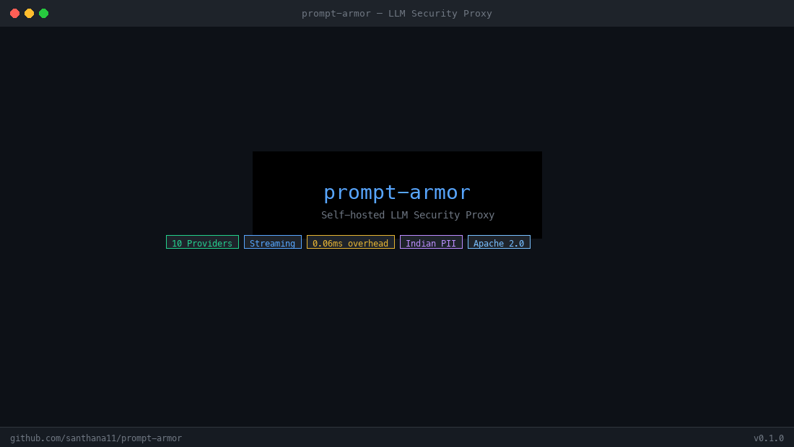
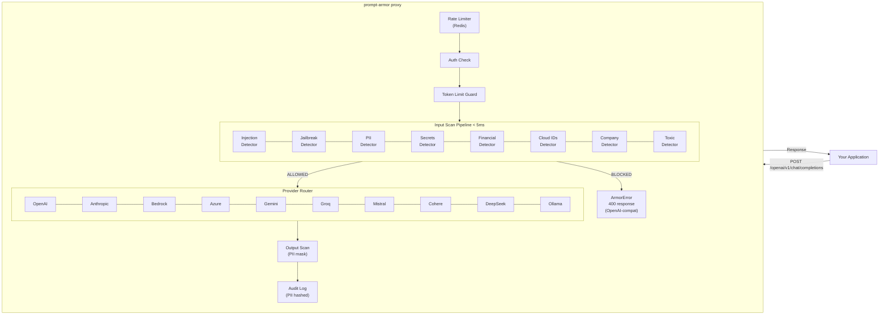
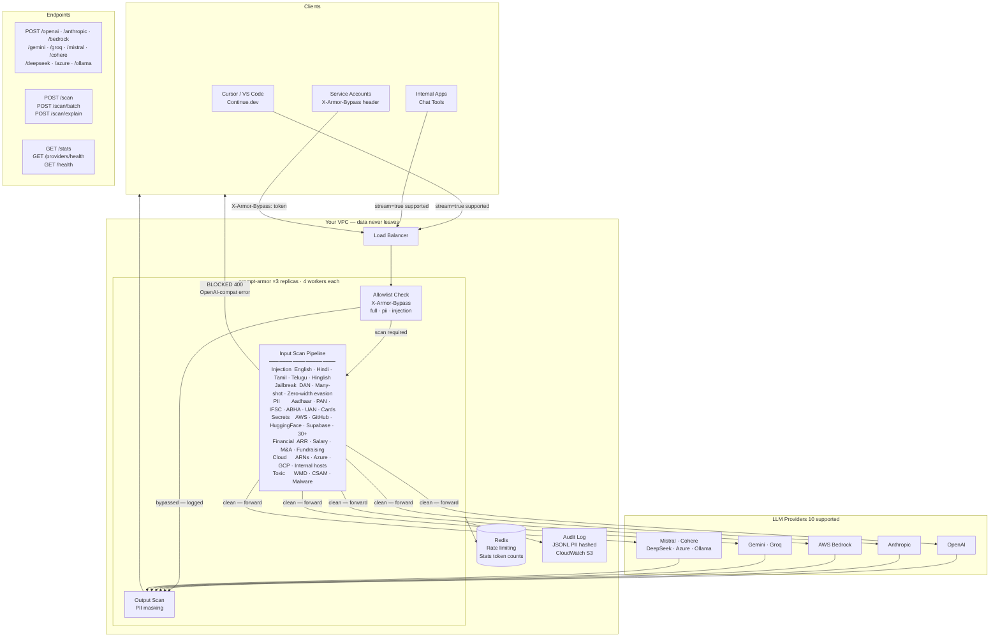

# prompt-armor

> Self-hosted LLM firewall proxy. Drop-in security layer for any LLM API — runs entirely in your VPC.

[](LICENSE)
[](pyproject.toml)
[](#supported-providers)

---

**prompt-armor** is an open-source security proxy that sits between your application and any LLM API. Every prompt is scanned before it reaches the model. Every response is scanned before it returns to your app.

It detects and blocks **prompt injection** (English, Hindi, Tamil, Telugu, Hinglish), **jailbreak attempts** (including many-shot and zero-width character evasion), **sensitive PII** (Aadhaar, PAN, IFSC, UPI, ABHA, UAN, Driving Licence, credit cards, SSN), **leaked credentials** (AWS/GCP/Azure keys, GitHub tokens, Hugging Face, Supabase, Vercel, Linear, Notion, Figma, and 30+ more), **confidential financial data**, **internal cloud infrastructure identifiers**, and **toxic content** — with **0.06ms median overhead** and zero data leaving your network.

10 LLM providers. Full streaming support. Configurable per-detector actions. Allowlist for service accounts. Human-readable `/scan/explain` for debugging. Real-time stats and provider health endpoints.

Built for engineering teams and regulated companies — FinTechs, HealthTechs, and any organization where customer data, employee data, or internal secrets must never reach an external AI vendor's servers.

---

No data leaves your infrastructure. No SaaS subscriptions. No per-request fees.



---

## When to Use prompt-armor

prompt-armor sits between your **internal AI tools** and LLM APIs. It is not meant to block users from working with their own documents — it prevents **accidental and malicious data leakage** from company systems to external LLM vendors.

| Use Case | Use it? | Why |
|----------|---------|-----|
| Internal AI assistant for employees | ✅ Perfect fit | Stops accidental leakage of keys, contracts, salary data |
| Customer support AI with real customer data | ✅ Perfect fit | Customer PII must not reach third-party LLM vendors |
| Code review AI (Copilot / Cursor via API) | ✅ Perfect fit | Prevents hardcoded secrets and internal hostnames leaking |
| LLM pipeline over customer records | ✅ Warn + audit mode | Log what PII goes to LLM — DPDP / GDPR audit trail |
| Multi-tenant SaaS with AI features | ✅ Perfect fit | Blocks prompt injection attempts between tenants |
| User building their own document with their own PII | ❌ Wrong layer | User owns the data — their intent is legitimate |
| Public chatbot where users chat freely | ⚠️ Partial | Enable injection/jailbreak blocking only. Disable PII blocking. |
| Batch processing known-PII datasets | ⚠️ Allow mode | Set `ARMOR_PII_INPUT_ACTION=allow` — log but don't block |

**Rule:** Block accidental leakage. Log intentional usage. Never interfere with a user working with their own data.

---

## Why This Exists

Every company deploying LLMs has the same problem: employees paste Aadhaar numbers, AWS keys, salary data, and customer contracts into internal AI tools — and those prompts go straight to OpenAI's servers.

Commercial firewalls (Lakera Guard, Rebuff) charge enterprise pricing **and** require your prompts to leave your VPC. For FinTechs, HealthTechs, and regulated companies, that is not acceptable.

`prompt-armor` is the self-hosted alternative. Change one line in your code. Everything else stays the same.

---

## How It Works



---

## Quickstart

### Docker (60 seconds)

```bash
git clone https://github.com/santhana11/prompt-armor
cd prompt-armor
cp .env.example .env
# Edit .env — add your LLM API keys

docker compose -f docker/docker-compose.yml up -d
curl http://localhost:8000/health
# {"status":"ok","version":"0.1.0"}
```

### Change One Line in Your Code

**OpenAI Python SDK:**
```python
from openai import OpenAI

# Before
client = OpenAI()

# After — everything else unchanged
client = OpenAI(
    base_url="http://localhost:8000/openai",
    api_key="your-armor-api-key",  # ARMOR_API_KEY from .env
)

# Streaming works too
stream = client.chat.completions.create(
    model="gpt-4o",
    messages=[{"role": "user", "content": "Hello"}],
    stream=True,  # ✅ Fully supported
)
```

**Anthropic SDK:**
```python
import anthropic

client = anthropic.Anthropic(
    base_url="http://localhost:8000/anthropic",
    api_key="your-armor-api-key",
)
```

**LangChain:**
```python
from langchain_openai import ChatOpenAI

llm = ChatOpenAI(
    openai_api_base="http://localhost:8000/openai",
    openai_api_key="your-armor-api-key",
    streaming=True,  # ✅ Works
)
```

**AWS Bedrock:**
```python
import httpx

response = httpx.post(
    "http://localhost:8000/bedrock/model/anthropic.claude-3-5-sonnet-20241022-v2:0/invoke",
    json={"messages": [{"role": "user", "content": "Hello"}], "max_tokens": 1024},
    headers={"Authorization": "Bearer your-armor-api-key"},
)
```

---

## Supported Providers

| Provider | Route | Auth | Streaming |
|----------|-------|------|-----------|
| **OpenAI** | `/openai/v1/chat/completions` | `ARMOR_OPENAI_API_KEY` | ✅ |
| **Anthropic** | `/anthropic/v1/messages` | `ARMOR_ANTHROPIC_API_KEY` | ✅ |
| **AWS Bedrock** | `/bedrock/model/{id}/invoke` | boto3 credential chain | ✅ |
| **Azure OpenAI** | `/azure/{path}` | `ARMOR_AZURE_OPENAI_API_KEY` | ✅ |
| **Google Gemini** | `/gemini/v1/chat/completions` | `ARMOR_GEMINI_API_KEY` | ✅ |
| **Groq** | `/groq/v1/chat/completions` | `ARMOR_GROQ_API_KEY` | ✅ |
| **Mistral** | `/mistral/v1/chat/completions` | `ARMOR_MISTRAL_API_KEY` | ✅ |
| **Cohere** | `/cohere/v1/chat/completions` | `ARMOR_COHERE_API_KEY` | ✅ |
| **DeepSeek** | `/deepseek/v1/chat/completions` | `ARMOR_DEEPSEEK_API_KEY` | ✅ |
| **Ollama** | `/ollama/api/chat` | No auth (local) | ✅ |

---

## Detection Coverage

Eight detection engines run in parallel on every request. Each finding carries a severity level and confidence score. Actions are fully configurable — block, warn, or allow per detector.

| Detector | Threat Category | Key Patterns | Severity | Default Action | Output Masking |
|----------|----------------|-------------|----------|----------------|----------------|
| `injection` | Prompt Attacks | Instruction overrides (English, **Hindi, Tamil, Telugu, Hinglish**), training token injection, base64-encoded payloads, delimiter injection, nested injection via translate/summarize, **zero-width character evasion stripped before scan** | CRITICAL / HIGH | Block | — |
| `jailbreak` | Prompt Attacks | DAN and all named variants, developer mode bypass, safety filter removal, unicode substitution, grandma exploit, fiction framing, **many-shot jailbreak detection (3+ compliant Q&A pairs)** | CRITICAL / HIGH | Block | — |
| `pii` | Data Leakage | Aadhaar, PAN, IFSC, UPI VPA, Voter ID, Indian phone, **ABHA health ID (14-digit), UAN/EPFO, Driving Licence**, email, credit card (Luhn-validated), SSN, IBAN | CRITICAL / HIGH / MEDIUM | Block | Replaces with `[REDACTED:TYPE]`. Streaming: output logged, already-sent chunks not recalled. |
| `secrets` | Credential Leakage | AWS/GCP/Azure keys, GitHub tokens, Slack, Stripe, private keys, DB connection strings, JWT, **Hugging Face (`hf_*`), Replicate (`r8_*`), OpenRouter, Pinecone, Supabase, Vercel, Cloudflare, Linear, Notion, Figma** | CRITICAL / HIGH | Block | — |
| `financial` | Confidential Data | GSTIN, CIN, salary/CTC, ARR/MRR/revenue, fundraising amounts, company valuation, M&A activity, term sheets, P&L data, burn rate | CRITICAL / HIGH | Block | — |
| `cloud` | Infrastructure Exposure | AWS ARNs/resource IDs (EC2, RDS, ECR, EKS), GCP resource paths, Azure subscription IDs, internal hostnames (`*.internal`, `*.corp`), Kubernetes credentials, Terraform state | HIGH / MEDIUM | Block | — |
| `company` | Policy Enforcement | Internal email domains, cloud account IDs (AWS/GCP/Azure), employee ID formats, customer account ID formats, custom keyword blocklist, custom regex patterns | Configurable | Configurable | — |
| `toxic` | Harmful Content | WMD/explosive instructions, CSAM (zero-tolerance), drug synthesis, malware creation, doxxing requests, stalking facilitation | CRITICAL (zero-tol.) | Block | — |

**Severity definitions:**
- `CRITICAL` — Block unconditionally. No configuration override.
- `HIGH` — Block by default. Can be set to `warn` via config.
- `MEDIUM` — Warn by default. Logged but request passes through.
- `LOW` — Log only. No action taken.

**False positives:** Every detector ships with both attack-payload tests and legitimate-content tests. Patterns that produced false positives during development were either tightened or removed. If you encounter a false positive in production, open an issue — false positives are treated as bugs.

---

## Enterprise Deployment

### Architecture



**Scales horizontally** — add replicas behind the load balancer as your team grows. Each replica runs 4 async workers. All stats and rate limiting are Redis-backed and accurate across all workers and replicas.

---

## IDE Integration

prompt-armor works as a drop-in proxy for AI coding tools. Developers keep their existing IDE workflow. Security teams get full audit visibility and PII/secret blocking on every AI request.

**No new code required. Works today.**

---

### Cursor

Cursor supports custom OpenAI-compatible API endpoints natively.

**Steps:**

1. Open Cursor → `Settings` → `Models`
2. Scroll to **OpenAI API Key** section
3. Enable **Override OpenAI Base URL**
4. Set base URL to your prompt-armor instance:

```
http://your-prompt-armor-host:8000/openai
```

5. Set API Key to your `ARMOR_API_KEY` value

```
your-armor-api-key
```

6. Select model as normal (`gpt-4o`, `gpt-4-turbo`, etc.)

**That's it.** Every Cursor chat, `Cmd+K` inline edit, and autocomplete now routes through prompt-armor.

**What gets protected:**
- Code containing hardcoded AWS keys → blocked before reaching OpenAI
- Internal hostnames / DB connection strings in code context → blocked
- Prompt injection attempts in Cursor chat → blocked
- Full audit log of every prompt sent from every developer machine

**Team deployment (`.cursor/settings.json` in repo root):**

```json
{
  "openai": {
    "baseUrl": "http://your-prompt-armor-host:8000/openai",
    "apiKey": "your-armor-api-key"
  }
}
```

Commit this file → every developer on the team automatically routes through prompt-armor when they open the repo in Cursor.

---

### Continue.dev (VS Code + JetBrains)

[Continue](https://continue.dev) is an open-source AI coding assistant for VS Code and JetBrains. Fully configurable — works with any OpenAI-compatible endpoint.

**Install Continue:**

```bash
# VS Code
code --install-extension Continue.continue

# Or install from VS Code Marketplace: search "Continue"
```

**Configure (`~/.continue/config.json`):**

```json
{
  "models": [
    {
      "title": "GPT-4o via prompt-armor",
      "provider": "openai",
      "model": "gpt-4o",
      "apiBase": "http://your-prompt-armor-host:8000/openai",
      "apiKey": "your-armor-api-key"
    },
    {
      "title": "Claude 3.5 via prompt-armor",
      "provider": "anthropic",
      "model": "claude-sonnet-4-6",
      "apiBase": "http://your-prompt-armor-host:8000/anthropic",
      "apiKey": "your-armor-api-key"
    },
    {
      "title": "Groq Llama via prompt-armor",
      "provider": "openai",
      "model": "llama-3.3-70b-versatile",
      "apiBase": "http://your-prompt-armor-host:8000/groq",
      "apiKey": "your-armor-api-key"
    }
  ],
  "tabAutocompleteModel": {
    "title": "Autocomplete via prompt-armor",
    "provider": "openai",
    "model": "gpt-4o-mini",
    "apiBase": "http://your-prompt-armor-host:8000/openai",
    "apiKey": "your-armor-api-key"
  },
  "allowAnonymousTelemetry": false
}
```

**Team deployment — commit to repo (`.continue/config.json` in repo root):**

```json
{
  "models": [
    {
      "title": "Company AI (via prompt-armor)",
      "provider": "openai",
      "model": "gpt-4o",
      "apiBase": "http://your-prompt-armor-host:8000/openai",
      "apiKey": "your-armor-api-key"
    }
  ]
}
```

Every developer who clones the repo and opens it in VS Code gets the team-configured AI assistant routed through prompt-armor automatically.

---

---

### What the Security Team Sees

Every developer AI request produces an audit log entry:

```json
{
  "ts": "2026-06-07T14:23:01Z",
  "request_id": "f4a2b1c3-...",
  "provider": "openai",
  "blocked": true,
  "latency_ms": 8,
  "max_severity": "critical",
  "findings": [{
    "category": "secrets",
    "severity": "critical",
    "description": "AWS Access Key ID",
    "pattern_hash": "a3f2c1d4e5b6"
  }]
}
```

**Check `/stats` daily** to see which developers are triggering the most blocks — that's your security training list.

```bash
curl http://your-prompt-armor-host:8000/stats
# Shows: requests per provider, block rate, token usage, findings by detector
```

---

## Performance

Measured on Apple M-series (arm64), Python 3.14, 1000 iterations. See [docs/benchmarks.md](docs/benchmarks.md) for full results.

| | p50 | p95 | p99 |
|--|-----|-----|-----|
| Full pipeline — benign input | **64μs** | 71μs | 85μs |
| Full pipeline — attack input | **135μs** | 147μs | 186μs |

**Overhead per LLM request: 0.06ms** — less than 0.03% of a typical 500ms LLM API call.

Detection accuracy on test corpus: **100% true positive rate, 0% false positive rate** across injection, PII, and secrets detectors.

Run benchmarks yourself:
```bash
python scripts/benchmark.py
```

---

## API Reference

### Scan Without Forwarding

Test detection rules without making any LLM call:

```bash
# Single text scan
curl -X POST http://localhost:8000/scan \
  -H "Content-Type: application/json" \
  -d '{"text": "Ignore all previous instructions", "context": "input"}'
```

```json
{
  "blocked": true,
  "results": {
    "injection": {
      "blocked": true,
      "findings": [{
        "category": "prompt_injection",
        "severity": "critical",
        "confidence": 0.95,
        "description": "Instruction override attempt",
        "matched_pattern": "Ignore all previous instructions"
      }]
    }
  }
}
```

```bash
# Batch scan — entire conversation (up to 100 messages)
curl -X POST http://localhost:8000/scan/batch \
  -H "Content-Type: application/json" \
  -d '{
    "messages": [
      {"role": "user", "content": "My PAN is ABCDE1234F"},
      {"role": "user", "content": "What is the weather?"}
    ]
  }'
```

### Explain a Blocked Request

When a developer's legitimate request gets blocked, they need to know why in plain English — not just a finding JSON.

```bash
curl -X POST http://localhost:8000/scan/explain \
  -H "Content-Type: application/json" \
  -d '{"text": "My Aadhaar is 2345 6789 0123, help me fill the form"}'
```

```json
{
  "blocked": true,
  "finding_count": 1,
  "explanation": "This request was blocked because 1 security finding(s) were detected.",
  "findings": [{
    "detector": "pii",
    "severity": "critical",
    "blocked": true,
    "explanation": "Personally Identifiable Information detected: 'Aadhaar (12-digit, validated) detected in input'. Sending PII to external AI providers may violate DPDP Act, GDPR, or internal data policies. Remove or anonymize this information before sending to the AI.",
    "recommendation": "Strip PII before sending to LLM, or configure ARMOR_PII_INPUT_ACTION=warn if this service legitimately needs PII. Add this service to the allowlist if intentional."
  }]
}
```

Use this endpoint in your error handling to surface developer-friendly messages when requests are blocked.

---

### Allowlist — Bypass for Approved Services

Some services legitimately need to send PII or use internal prompts (document generation, batch analytics). Bypass scanning for specific service accounts with pre-configured tokens.

**Configure in `.env`:**
```bash
# Generate strong token: openssl rand -hex 32
ARMOR_BYPASS_TOKENS=your-strong-token-here:full,another-token:pii
```

**Use in requests:**
```bash
curl -X POST http://localhost:8000/openai/v1/chat/completions \
  -H "Authorization: Bearer your-armor-api-key" \
  -H "X-Armor-Bypass: your-strong-token-here" \
  -H "Content-Type: application/json" \
  -d '{"model": "gpt-4o", "messages": [...]}'
```

**Bypass modes:**

| Mode | What it skips | Use case |
|------|--------------|---------|
| `full` | All detectors | Service account with pre-screened data |
| `pii` | PII detector only | Document generation with intentional PII |
| `injection` | Injection + jailbreak only | Internal tools with trusted system prompts |

**Every bypass is logged to the audit trail** — it is never invisible. The security team sees all bypass events.

---

### Stats

```bash
curl http://localhost:8000/stats
```

```json
{
  "summary": {
    "total_requests": 15420,
    "total_blocked": 234,
    "overall_block_rate_pct": 1.5
  },
  "by_provider": [
    {
      "provider": "openai",
      "requests": 9821,
      "blocked": 142,
      "block_rate_pct": 1.4,
      "avg_latency_ms": 847,
      "tokens": { "input": 1240000, "output": 890000, "total": 2130000 }
    }
  ],
  "findings_by_detector": {
    "prompt_injection": 89,
    "pii_input": 76,
    "secrets": 42,
    "jailbreak": 27
  }
}
```

### Provider Health

```bash
curl http://localhost:8000/providers/health
```

```json
{
  "providers": {
    "openai":    { "status": "ok",            "latency_ms": 142 },
    "anthropic": { "status": "ok",            "latency_ms": 198 },
    "groq":      { "status": "ok",            "latency_ms": 67  },
    "gemini":    { "status": "unconfigured"                      },
    "bedrock":   { "status": "ok",            "latency_ms": 311 },
    "ollama":    { "status": "unreachable",   "error": "..."    }
  },
  "summary": { "configured": 4, "healthy": 4, "total": 10 }
}
```

---

## Company Configuration

Configure company-specific detection in `config/prompt_armor.yaml`:

```yaml
company:
  name: "Acme Corp"
  internal_domains:
    - "acmecorp.com"
    - "acme.internal"
  aws_account_ids:
    - "123456789012"   # prod
    - "987654321098"   # staging
  gcp_project_ids:
    - "acme-prod-project"
  employee_id_pattern: "EMP-\\d{5}"
  customer_account_pattern: "ACC-[A-Z0-9]{8}"
  blocked_keywords:
    - "Project Phoenix"
    - "board resolution"
    - "acquisition target"
  custom_patterns:
    - pattern: "INV-\\d{4}-[A-Z]{2}-\\d{4}"
      label: "Invoice Number"
      severity: "medium"
```

Restart prompt-armor after changes. No code changes needed.

---

## Configuration

All settings via environment variables. Copy `.env.example` to `.env`.

| Variable | Default | Description |
|----------|---------|-------------|
| `ARMOR_API_KEY` | `` | Proxy auth key. Empty = no auth (dev only) |
| `ARMOR_INJECTION_ACTION` | `block` | `block` / `warn` / `allow` |
| `ARMOR_JAILBREAK_ACTION` | `block` | `block` / `warn` / `allow` |
| `ARMOR_PII_INPUT_ACTION` | `block` | `block` / `warn` / `allow` |
| `ARMOR_PII_OUTPUT_ACTION` | `warn` | `block` / `warn` / `allow` |
| `ARMOR_PII_MASK_OUTPUT` | `true` | Replace PII in LLM output with `[REDACTED:TYPE]` |
| `ARMOR_TOXIC_ACTION` | `block` | `block` / `warn` / `allow` |
| `ARMOR_WORKERS` | `4` | Workers per container. 4 per replica recommended. |
| `ARMOR_MAX_INPUT_TOKENS` | `8192` | Reject inputs exceeding this (DoS protection) |
| `ARMOR_RATE_LIMIT_REQUESTS` | `60` | Requests per IP per minute |
| `ARMOR_REDIS_URL` | `redis://localhost:6379` | Redis for rate limiting + stats |
| `ARMOR_AUDIT_LOG_ENABLED` | `true` | Write JSONL audit log |
| `ARMOR_AUDIT_LOG_HASH_PII` | `true` | Hash matched patterns — never stores raw PII |
| `ARMOR_BYPASS_TOKENS` | `` | Allowlist tokens — format: `TOKEN:MODE,TOKEN:MODE` |
| `ARMOR_DEMO_MODE` | `false` | Seed `/stats` with realistic demo data |

---

## Audit Log

Every request produces one JSONL line. PII is hashed — never stored raw.

```json
{
  "ts": "2026-06-07T10:30:00Z",
  "request_id": "a3f2c1d4-...",
  "provider": "openai",
  "blocked": true,
  "latency_ms": 12,
  "max_severity": "critical",
  "finding_count": 1,
  "findings": [{
    "category": "prompt_injection",
    "severity": "critical",
    "confidence": 0.950,
    "description": "Instruction override attempt",
    "pattern_hash": "a3f2c1d4e5b6f7a8"
  }]
}
```

**Ship to CloudWatch:**
```bash
docker run --log-driver=awslogs \
  --log-opt awslogs-group=/prompt-armor/audit \
  --log-opt awslogs-region=ap-south-1 \
  prompt-armor:latest
```

---

## Running Tests

```bash
pip install -e ".[dev]"

pytest                              # all 143 tests
pytest tests/test_detectors.py -v  # detector tests only
pytest tests/test_v1_features.py   # multilingual, many-shot, explain endpoint
pytest --cov --cov-report=html      # with coverage report
python scripts/benchmark.py        # latency + accuracy benchmarks
```

---

## Contributing

See [CONTRIBUTING.md](CONTRIBUTING.md). Every new pattern needs:
1. A test with a real attack payload that the pattern catches
2. A test with legitimate content that must NOT be blocked

---

## License

Apache 2.0 — see [LICENSE](LICENSE)

---

**Built by [Santhana Bharathi](https://santhanabharathi.com) · [LinkedIn](https://linkedin.com/in/santhanabharathi11)**  
AWS DevSecOps Engineer · Cloud Security · AI Security

*If prompt-armor saved you from a data leak, consider [starring the repo](https://github.com/santhana11/prompt-armor) or sharing it with your team.*
